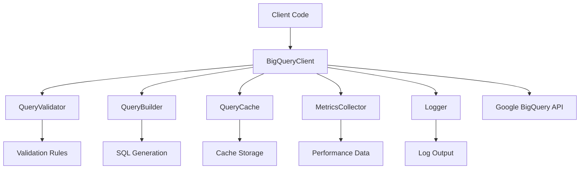

# BigQuery Client ORM - Architecture Documentation

## 📁 Project Structure

The BigQuery Client ORM follows a modular architecture with clear separation of concerns. Here's the detailed folder structure:

```
bigquery-client/
├── 📁 src/                          # Source code
│   ├── 📁 core/                     # Core functionality
│   │   ├── BigQueryClient.ts        # Main client class
│   │   ├── QueryBuilder.ts          # SQL query building logic
│   │   ├── Pool.ts                  # Connection pooling
│   │   ├── Transaction.ts           # Transaction management
│   │   └── index.ts                 # Core module exports
│   ├── 📁 lib/                      # Library utilities
│   │   ├── 📁 cache/               # Caching functionality
│   │   │   ├── cache.ts            # QueryCache implementation
│   │   │   └── index.ts            # Cache module exports
│   │   ├── 📁 metrics/             # Metrics and monitoring
│   │   │   ├── metrics.ts          # MetricsCollector implementation
│   │   │   └── index.ts            # Metrics module exports
│   │   ├── 📁 validation/          # Input validation
│   │   │   ├── validation.ts       # QueryValidator implementation
│   │   │   └── index.ts            # Validation module exports
│   │   └── 📁 logging/             # Logging utilities
│   │       ├── Logger.ts           # Logger implementation
│   │       └── index.ts            # Logging module exports
│   ├── 📁 types/                    # TypeScript type definitions
│   │   └── index.ts                # All type exports
│   ├── 📁 errors/                   # Custom error classes
│   │   └── index.ts                # Error class exports
│   ├── 📁 config/                   # Configuration files
│   │   ├── constants.ts            # Application constants
│   │   └── index.ts                # Config module exports
│   └── index.ts                     # Main entry point
├── 📁 tests/                        # Test files
│   ├── 📁 unit/                     # Unit tests
│   │   ├── 📁 utils/               # Utility tests
│   │   ├── BigQueryClient.test.ts  # Core client tests
│   │   ├── Logger.test.ts          # Logger tests
│   │   └── QueryBuilder.test.ts    # Query builder tests
│   ├── 📁 integration/              # Integration tests
│   └── 📁 fixtures/                 # Test data and fixtures
├── 📁 docs/                         # Documentation
│   └── ARCHITECTURE.md             # This file
├── 📁 examples/                     # Usage examples
│   ├── basic-usage.ts              # Basic functionality examples
│   └── advanced-features.ts        # Advanced features examples
├── 📁 scripts/                      # Build and utility scripts
└── 📁 dist/                         # Compiled output
```

## 🏗️ Architecture Principles

### 1. **Modular Design**
- **Core Module**: Contains the main business logic and primary classes
- **Lib Module**: Houses utility libraries that can be used independently
- **Clear Boundaries**: Each module has a specific responsibility and well-defined interfaces

### 2. **Separation of Concerns**
- **Data Access**: BigQueryClient handles all BigQuery operations
- **Query Building**: QueryBuilder provides SQL construction utilities
- **Caching**: QueryCache manages result caching with TTL and LRU
- **Monitoring**: MetricsCollector tracks performance and usage
- **Validation**: QueryValidator ensures security and data integrity
- **Logging**: Logger provides comprehensive operation logging

### 3. **Dependency Management**
- **Hierarchical Imports**: Core depends on lib, lib depends on types/config
- **No Circular Dependencies**: Clean dependency graph prevents circular imports
- **Interface-Based**: Modules communicate through well-defined interfaces

## 📦 Module Descriptions

### Core Module (`src/core/`)
Contains the primary business logic and main classes:

- **BigQueryClient**: Main ORM class providing CRUD operations, caching, and advanced features
- **QueryBuilder**: Fluent API for building complex SQL queries
- **Pool**: Connection pooling for efficient resource management
- **Transaction**: Transaction management for atomic operations

### Library Module (`src/lib/`)
Utility libraries that provide supporting functionality:

#### Cache (`src/lib/cache/`)
- **QueryCache**: High-performance in-memory caching with TTL and LRU eviction
- Features: Automatic expiration, size limits, performance metrics

#### Metrics (`src/lib/metrics/`)
- **MetricsCollector**: Performance monitoring and analytics
- Features: Query metrics, error tracking, statistical analysis

#### Validation (`src/lib/validation/`)
- **QueryValidator**: Security and data validation
- Features: SQL injection protection, parameter validation, schema validation

#### Logging (`src/lib/logging/`)
- **Logger**: Comprehensive logging functionality
- Features: Configurable levels, structured output, log rotation

### Configuration (`src/config/`)
- **constants.ts**: Application-wide constants and default configurations
- Centralized configuration management

### Types (`src/types/`)
- **index.ts**: All TypeScript type definitions and interfaces
- Shared types across all modules

### Errors (`src/errors/`)
- **index.ts**: Custom error classes for different error scenarios
- Structured error handling

## 🔄 Data Flow



## 🛡️ Security Architecture

### Input Validation
- **SQL Injection Protection**: Pattern-based detection and prevention
- **Parameter Validation**: Type checking and sanitization
- **Schema Validation**: Structure and type validation

### Error Handling
- **Structured Errors**: Custom error classes with detailed information
- **Error Logging**: Comprehensive error tracking and analysis
- **Graceful Degradation**: Fallback mechanisms for non-critical failures

## 📈 Performance Architecture

### Caching Strategy
- **Query Result Caching**: TTL-based with LRU eviction
- **Metadata Caching**: Schema and table information caching
- **Configurable Policies**: Flexible caching configuration

### Connection Management
- **Connection Pooling**: Efficient resource utilization
- **Health Monitoring**: Connection health checks and recovery
- **Load Balancing**: Distributed query execution

### Monitoring
- **Real-time Metrics**: Query performance and resource usage
- **Historical Analysis**: Trend analysis and optimization insights
- **Alerting**: Performance threshold monitoring

## 🧪 Testing Architecture

### Unit Tests (`tests/unit/`)
- **Component Testing**: Individual module testing
- **Mock Dependencies**: Isolated testing with mocked dependencies
- **Coverage Tracking**: Comprehensive test coverage reporting

### Integration Tests (`tests/integration/`)
- **End-to-End Testing**: Full workflow testing
- **Real BigQuery Integration**: Testing against actual BigQuery instances
- **Performance Testing**: Load and stress testing

### Test Fixtures (`tests/fixtures/`)
- **Sample Data**: Reusable test data sets
- **Mock Configurations**: Standard test configurations
- **Schema Definitions**: Test table schemas

## 🚀 Build and Deployment

### TypeScript Compilation
- **Source Maps**: Debug-friendly compiled output
- **Type Checking**: Strict TypeScript validation
- **Module Resolution**: Proper import/export handling

### Package Distribution
- **NPM Publishing**: Optimized package structure
- **Tree Shaking**: Dead code elimination support
- **Multiple Formats**: CommonJS and ES modules support

## 📚 Documentation Strategy

### Code Documentation
- **JSDoc Comments**: Comprehensive inline documentation
- **Type Annotations**: Full TypeScript type coverage
- **Example Code**: Practical usage examples

### User Documentation
- **API Reference**: Complete API documentation
- **Usage Guides**: Step-by-step tutorials
- **Best Practices**: Recommended patterns and practices

This architecture ensures maintainability, scalability, and ease of use while providing comprehensive BigQuery functionality with enterprise-grade features. 